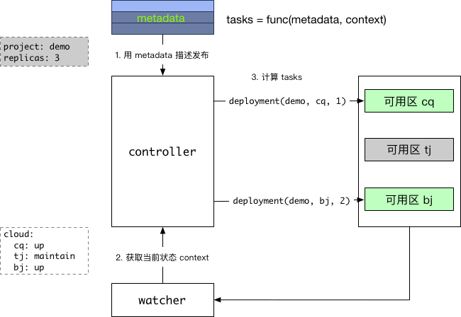
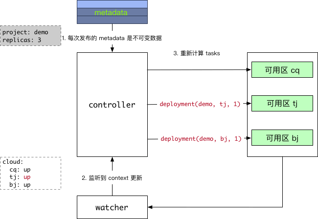
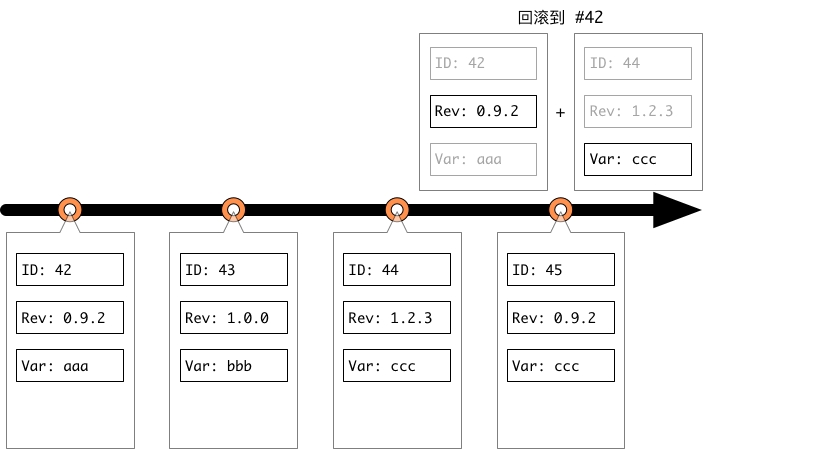

- 项目可以多次发布。
- 每次发布，都用一个 metadata 对象来描述发布的 **规格**、**约束** 等；
- metadata 是 **不可变** 的，要改变必须重新发布；
- metadata 是 **声明式**（Declarative，对应命令式: Imperative ）的；
- 回滚也是一次发布。

## 1
* * *
## 新建发布流程

### 1.1
* * *
### 流程说明

- 为此次发布新建 metadata（把项目 demo 在云上部署 3 个示例）；
- 获取云的当前状态 context；
- 根据 context, 计算出要达到 metadata 的要求，所需要的具体任务列表 tasks。

### 1.2
* * *
### 计算公式：tasks = func(metadata, context)

- 给定 metadata: {project:demo, replicas:3}；
- 当前 context: cq 和 bj 机房正常， tj 机房维护中；
- 假设我们的发布策略是示例平均分配到各机房，但 bj 优先；
- 那么计算结果是：在 cq 部署 1 个节点， bj 部署两个节点；
- 如果给定的 context, metadata 不变，那么计算出的 tasks 也是始终一致的；
- **metadata 中声明的约束和计算能力有关**。比如可以声明 { 响应时间 < 500ms }，然后由 controller 自动算出目前需要部署多少个实例，并实时根据流量等的变化扩缩容，保证满足要求。

## 2
* * *
## Context 改变，触发重新计算 tasks

### 2.1
* * *
### 流程说明

1. 每次发布的 metadata 都是不可变数据（如要改变，只能重新创建新的发布）；
2. controller 通过监听 watcher，实时得知 tj 机房已恢复正常；
3. 计算出新的 tasks：在 tj 部署 1 个节点，把 bj 的 2 个节点改为 1 个。

## 3
* * *
## 回滚也是一次发布

### 3.1
* * *
### 流程说明

1. 每次发布都由一个不变的 metadata 描述，并具备一个唯一的发布 id；
2. 回滚也是一次发布，生成新的 metadata 和 id。
