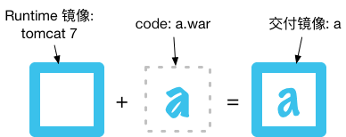
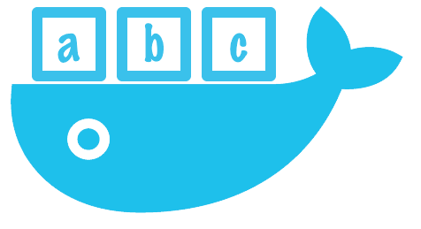
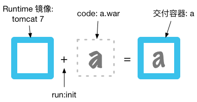

容器镜像，是用容器方式交付环境的基础。可表述为：

**容器镜像 = runtime + code** 

```docker
FROM tomcat:7
ADD a.war /app/a.war
```



在这里我们为项目 a 制作了镜像，里面封装了 tomcat7 + a.war。通过这种镜像方式封装，成千上万项目得以使用统一的规格在容器云上线。


## 1
* * *
## 场景：Runtime 多版本共存



为计算方便。假设以这种方式，我们上线了 1000 个项目。为了快速回滚要求每个项目保存 5 个版本，平均每个项目的镜像大小 200M 的话：

> 镜像仓库存储需求：1000 x 5 x 200M = 1T
 
此外，还存在 Runtime 多版本共存的场景：

- 升级：比如开发人员或安全人员要求从 tomcat 7 升级到 tomcat 8，在滚动升级完成前 7 和 8 会共存；
- 环境差异：比如镜像里包含了一个 APM 探针，且该镜像在 prod 运行的时候 APM Server 要求探针版本为 1.0, 而在 test 时要 2.0；
- 比如金丝雀发布，要求 1:1:8 的流量分别跑 v1, v2, v3 等。

此时会遇到问题：

### 1.1
* * *
### 空间占用问题

　　上面说了我们有 1T 镜像。如果需要支持 3 个版本的 Runtime ，存储需求乘以 3，3T。
这将对我们捉襟见肘的存储空间带来不小的压力。

### 1.2
* * *
### 紧急响应时间

　　**Runtime 更换时间 = 新镜像构建时间 + 新镜像分发时间 + 镜像滚动更新时间**

　　如果这次 Runtime 更换是紧急响应呢？比如 tomcat 7 出现致命漏洞，需要马上升级。

　　但是重新构建 1000 个项目，并分发 500G (200M x 1000) 镜像，分发的时候还需要限速以免拥堵网络。那么更换下来的时间可能将长达数小时，让人难以接受。

> 镜像滚动更新时间优化余地不大。时间占用的大头是新镜像构建时间 + 新镜像分发时间。如果我们更换 Runtime 时，不需要重新构建所有项目。不需要重新分发所有镜像呢？

## 2
* * *
## 方案：镜像运行时加载代码



在用户看来，结果不变，仍然得到了项目 a 及其环境。**但交付形式改变**。不再存在项目 a 的镜像。而只有 Runtime 镜像（tomcat:7），并在运行这个镜像的初始化过程中，加载了项目 a 的 code（a.war）。

这样可以避免上面的问题：

- 空间占用：每多支持 1 个版本的 Runtime， 存储不需要增加 1T， 只需 200M；
- 紧急响应时间：只需构建一个新的 Runtime 镜像，分发 200M。

## 3
* * *
## 实施

### 3.1
* * *
### code 以软件包的形式封装

　　即我们可以把代码打成 rpm 包。然后在镜像启动时 yum install a 即可。
　　
### 3.2
* * *
### code 以镜像的形式封装

```docker
FROM alpine
ADD a.war /app/a.war
```

　　我们还可以把代码封装成一个单独镜像。这样带来一个额外的好处是，开发人员可以在这个镜像里额外放置一些 dev, debug 工具。在 kubernetes 环境，可以这么组装：

```yaml
apiVersion: v1
kind: Pod
metadata:
  name: demo
  labels:
    demo: t
  annotations:
    pod.beta.kubernetes.io/init-containers: '[
        {
            "name": "load-project",
            "image": "hub.me/a:v1",
            "command": ["cp", "/app/a.war", "/code"],
            "volumeMounts": [
                {
                    "name": "code",
                    "mountPath": "/code"
                }
            ]
        }
    ]'
spec:
  containers:
  - name: app
    image: hub.me/tomcat:7-cloud
    volumeMounts:
    - mountPath: "/app/"
      name: code

  volumes:
  - name: code
    emptyDir: {}
```